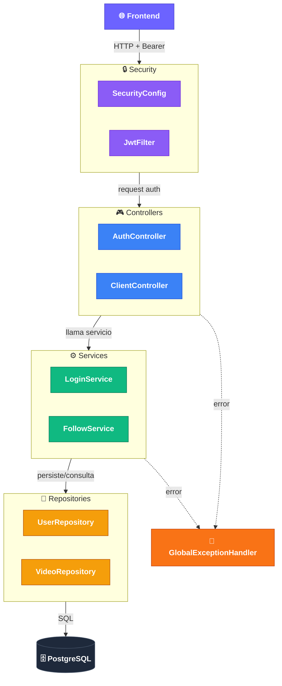

# Diagrama de Composición — Arquitectura Spotter

```mermaid
graph TB
    classDef frontend   fill:#6C63FF,stroke:#4B44CC,color:#fff,font-weight:bold
    classDef security   fill:#8B5CF6,stroke:#6D28D9,color:#fff,font-weight:bold
    classDef controller fill:#3B82F6,stroke:#1D4ED8,color:#fff,font-weight:bold
    classDef service    fill:#10B981,stroke:#047857,color:#fff,font-weight:bold
    classDef repo       fill:#F59E0B,stroke:#B45309,color:#fff,font-weight:bold
    classDef db         fill:#1E293B,stroke:#475569,color:#fff,font-weight:bold
    classDef exception  fill:#F97316,stroke:#C2410C,color:#fff,font-weight:bold

    FE["🌐 Frontend"]:::frontend

    subgraph SEC["🔒 Security"]
        S1["SecurityConfig"]:::security
        S2["JwtFilter"]:::security
    end

    subgraph CTRL["🎮 Controllers"]
        C1["AuthController"]:::controller
        C2["ClientController"]:::controller
    end

    subgraph SVC["⚙️ Services"]
        SV1["LoginService"]:::service
        SV2["FollowService"]:::service
    end

    subgraph REPO["📂 Repositories"]
        R1["UserRepository"]:::repo
        R2["VideoRepository"]:::repo
    end

    DB[("🗄️ PostgreSQL")]:::db
    EXC["🚨 GlobalExceptionHandler"]:::exception

    FE      -->|"HTTP + Bearer"| SEC
    SEC     -->|"request auth"| CTRL
    CTRL    -->|"llama servicio"| SVC
    SVC     -->|"persiste/consulta"| REPO
    REPO    -->|"SQL"| DB
    CTRL    -.->|"error"| EXC
    SVC     -.->|"error"| EXC
```
