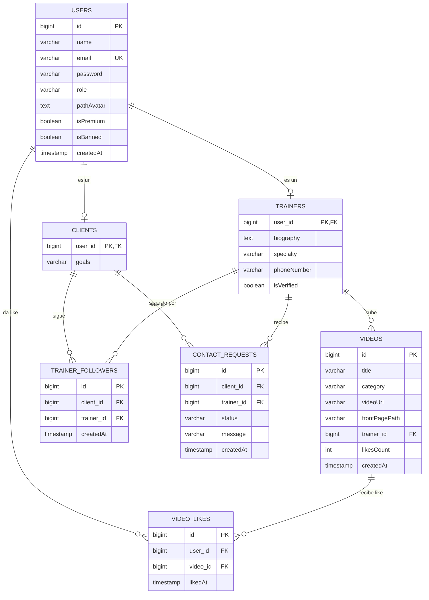

# Diagrama Entidad-Relación — Spotter DB

```mermaid
erDiagram
    USERS {
        bigint id PK
        varchar name
        varchar email UK
        varchar password
        varchar role
        text pathAvatar
        boolean isPremium
        boolean isBanned
        timestamp createdAt
    }

    CLIENTS {
        bigint user_id PK,FK
        varchar goals
    }

    TRAINERS {
        bigint user_id PK,FK
        text biography
        varchar specialty
        varchar phoneNumber
        boolean isVerified
    }

    VIDEOS {
        bigint id PK
        varchar title
        varchar category
        varchar videoUrl
        varchar frontPagePath
        bigint trainer_id FK
        int likesCount
        timestamp createdAt
    }

    TRAINER_FOLLOWERS {
        bigint id PK
        bigint client_id FK
        bigint trainer_id FK
        timestamp createdAt
    }

    VIDEO_LIKES {
        bigint id PK
        bigint user_id FK
        bigint video_id FK
        timestamp likedAt
    }

    CONTACT_REQUESTS {
        bigint id PK
        bigint client_id FK
        bigint trainer_id FK
        varchar status
        varchar message
        timestamp createdAt
    }

    USERS ||--o| CLIENTS            : "es un"
    USERS ||--o| TRAINERS           : "es un"
    TRAINERS ||--o{ VIDEOS          : "sube"
    CLIENTS ||--o{ TRAINER_FOLLOWERS  : "sigue"
    TRAINERS ||--o{ TRAINER_FOLLOWERS : "seguido por"
    USERS ||--o{ VIDEO_LIKES        : "da like"
    VIDEOS ||--o{ VIDEO_LIKES       : "recibe like"
    CLIENTS ||--o{ CONTACT_REQUESTS   : "envía"
    TRAINERS ||--o{ CONTACT_REQUESTS  : "recibe"
```
