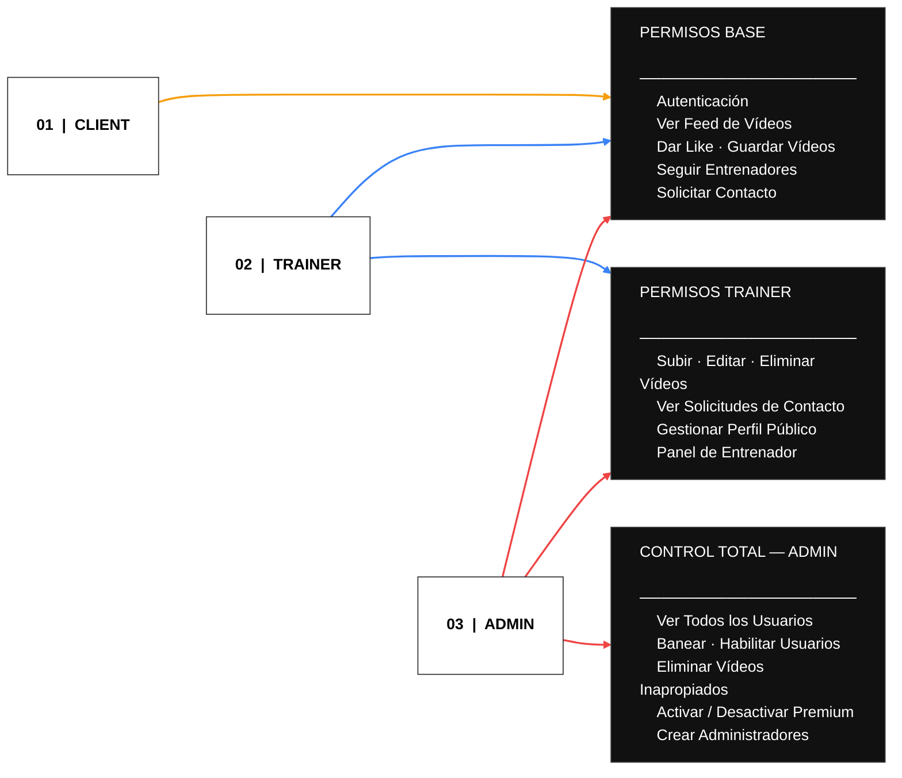

# Diagrama de Gestión de Roles — Spotter

```mermaid
flowchart LR
    classDef role  fill:#ffffff,stroke:#2c2c2c,color:#000000,font-weight:bold,padding:8px
    classDef perms fill:#111111,stroke:#3d3d3d,color:#ffffff,text-align:left

    %% ── ROLES (izquierda) ───────────────────────────────────────────────
    R1["01 &nbsp;|&nbsp; CLIENT"]:::role
    R2["02 &nbsp;|&nbsp; TRAINER"]:::role
    R3["03 &nbsp;|&nbsp; ADMIN"]:::role

    %% ── BLOQUES DE PERMISOS (derecha) ───────────────────────────────────
    P1["PERMISOS BASE
    ────────────────────
    Autenticación
    Ver Feed de Vídeos
    Dar Like · Guardar Vídeos
    Seguir Entrenadores
    Solicitar Contacto"]:::perms

    P2["PERMISOS TRAINER
    ────────────────────
    Subir · Editar · Eliminar Vídeos
    Ver Solicitudes de Contacto
    Gestionar Perfil Público
    Panel de Entrenador"]:::perms

    P3["CONTROL TOTAL — ADMIN
    ────────────────────
    Ver Todos los Usuarios
    Banear · Habilitar Usuarios
    Eliminar Vídeos Inapropiados
    Activar / Desactivar Premium
    Crear Administradores"]:::perms

    %% ── CONEXIONES ──────────────────────────────────────────────────────
    R1 --> P1
    R2 --> P1
    R2 --> P2
    R3 --> P1
    R3 --> P2
    R3 --> P3

    %% ── ORDEN VERTICAL DE ROLES ─────────────────────────────────────────
    R1 ~~~ R2
    R2 ~~~ R3

    %% ── COLORES DE FLECHAS (por índice de aparición) ────────────────────
    %% 0: R1→P1 (amarillo)
    %% 1: R2→P1 (azul)
    %% 2: R2→P2 (azul)
    %% 3: R3→P1 (rojo)
    %% 4: R3→P2 (rojo)
    %% 5: R3→P3 (rojo)
    linkStyle 0 stroke:#f59e0b,stroke-width:2px
    linkStyle 1 stroke:#3b82f6,stroke-width:2px
    linkStyle 2 stroke:#3b82f6,stroke-width:2px
    linkStyle 3 stroke:#ef4444,stroke-width:2px
    linkStyle 4 stroke:#ef4444,stroke-width:2px
    linkStyle 5 stroke:#ef4444,stroke-width:2px
```
