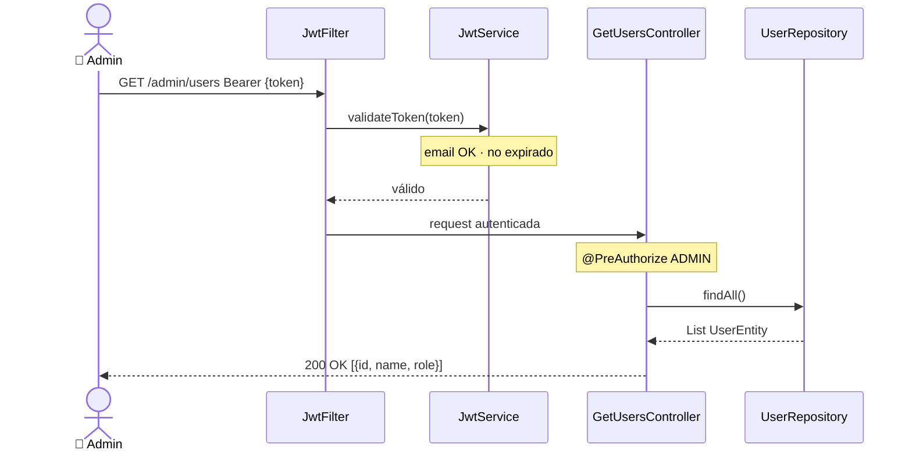

# Diagrama de Secuencia — Obtener Usuarios (Admin)

```mermaid
sequenceDiagram
    actor A as 👑 Admin
    participant JF as JwtFilter
    participant JS as JwtService
    participant GUC as GetUsersController
    participant UR as UserRepository

    A->>JF: GET /admin/users  Bearer {token}
    JF->>JS: validateToken(token)
    Note over JS: email OK · no expirado
    JS-->>JF: válido
    JF->>GUC: request autenticada
    Note over GUC: @PreAuthorize ADMIN
    GUC->>UR: findAll()
    UR-->>GUC: List UserEntity
    GUC-->>A: 200 OK [{id, name, role}]
```
