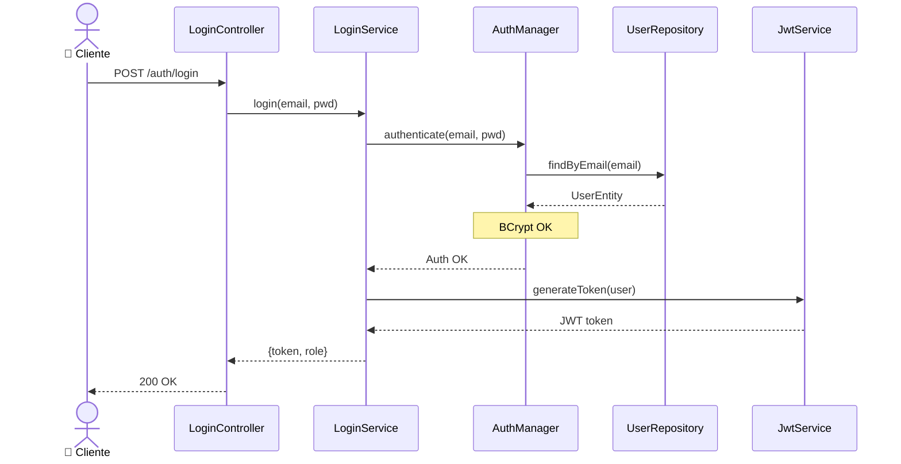

# Diagrama de Secuencia — Login

```mermaid
sequenceDiagram
    actor C as 👤 Cliente
    participant LC as LoginController
    participant LS as LoginService
    participant AM as AuthManager
    participant UR as UserRepository
    participant JS as JwtService

    C->>LC: POST /auth/login
    LC->>LS: login(email, pwd)
    LS->>AM: authenticate(email, pwd)
    AM->>UR: findByEmail(email)
    UR-->>AM: UserEntity
    Note over AM: BCrypt OK
    AM-->>LS: Auth OK
    LS->>JS: generateToken(user)
    JS-->>LS: JWT token
    LS-->>LC: {token, role}
    LC-->>C: 200 OK
```
